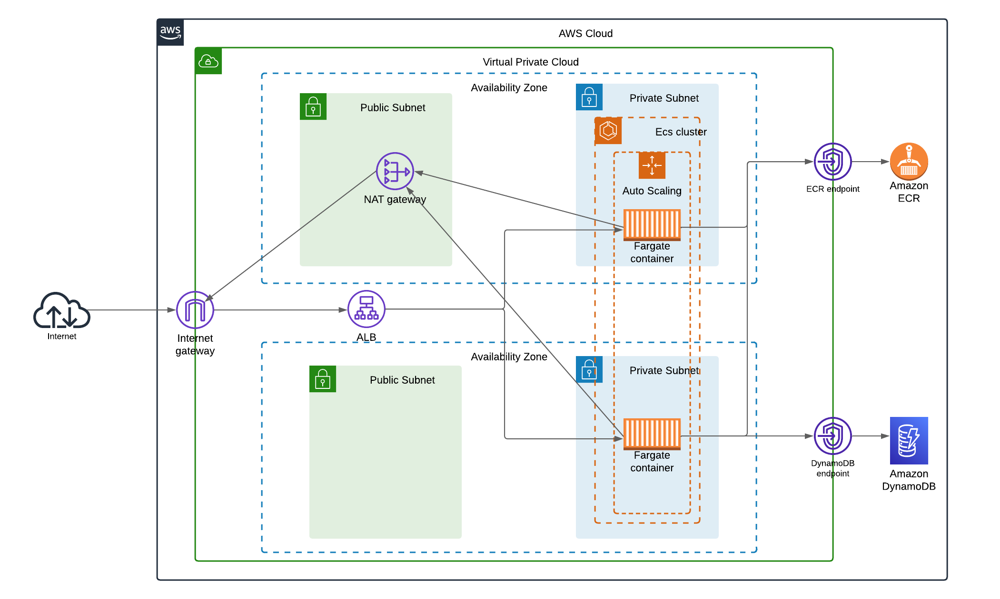

# AWS-ALB-ECS-DYNAMODB

This is a template for ECS(fargate), ALB and DynamoDB pattern

To utilize this project, please ensure that you possess the following requirements:
 1. Your have your own AWS account setup, with access keys for a deployment role.
 2. Docker installed on your machine.
 3. Terraform installed on your machine.
 4. AWS CLI Installed.

Steps to use:
 1. Clone this repo to your desired location.
 2. Edit the terraform.tfvars file with your desired values.
 3. Run "terraform init", "terraform plan" and "terraform apply".
 4. Build your docker app and push the image to the ecr repo using those commands : 
   - aws ecr get-login-password --region ${var.region} --profile personal| docker login --username AWS --password-stdin ${local.account_id}.dkr.ecr.${var.region}.amazonaws.com
   - "docker build -t ${aws_ecr_repository.ecr.name} ./app"
   - docker tag ${aws_ecr_repository.ecr.name}:latest ${local.account_id}.dkr.ecr.${var.region}.amazonaws.com/${aws_ecr_repository.ecr.name}:latest
   - docker push ${local.account_id}.dkr.ecr.${var.region}.amazonaws.com/${aws_ecr_repository.ecr.name}:latest
 5. Access the application by navigate to the Load Balancer section in the AWS console and paste the dns name of the Load Balancer in a new tab.

